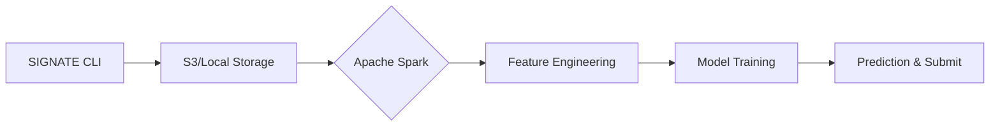

# Scalable Spectral Analysis Pipeline 🌾

[](https://signate.jp/)
[](https://www.python.org/downloads/release/python-390/)
[](https://spark.apache.org/)

## 📝 Overview
本プロジェクトは、SIGNATEで開催されている「近赤外研究会 スペクトル分析チャレンジ」を題材に、高次元データに対する**スケーラブルなデータパイプライン**と**高精度な予測モデル**の構築を目指すものです。

単なるモデル作成に留まらず、AWS Glue等のクラウド環境を想定した **Apache Sparkによる分散処理** を前処理の基盤として採用しています。

## 🎯 Key Objectives (100点満点へのアプローチ)
- **Scalability**: PySparkを用いた120次元超のスペクトルデータの高速処理。
- **Modern Data Engineering**: ADR (Architecture Decision Records) に基づく技術選定の透明化。
- **Production-Ready**: CI/CD (GitHub Actions) を想定したモジュール化されたディレクトリ構造。
- **Business ROI**: 木材の含水率予測という製造業の品質管理に直結する課題解決。

## 🏗️ Architecture & Pipeline
データ収集から提出（Submit）までの一貫したパイプラインを構築。



## 🛠️ Tech Stack
- **Languages**: Python
- **Data Processing**: Apache Spark (PySpark), Pandas
- **Infrastructure**: Terraform (Plan), AWS Glue (Assumed)
- **ML Frameworks**: Scikit-learn, XGBoost/LightGBM
- **Governance**: ADR, .gitignore (Data Security)

## 📁 Directory Structure
```text
.
├── data/               # Data files (Git ignored)
├── src/                # Spark Preprocessing & Training scripts
├── notebooks/          # Exploratory Data Analysis (EDA)
├── docs/               # ADR and technical documents
└── .gitignore          # Data & Cache security
```
## 🚀 How to Run
```bash
# Clone the repository
git clone https://github.com/kou-sato-ds/Scalable-Spectral-Analysis-Pipeline.git

# Install dependencies (Example)
pip install pyspark

# Initialize Spark Session & Preprocessing
python src/preprocess.py