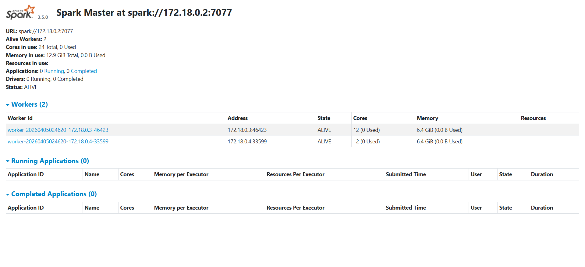
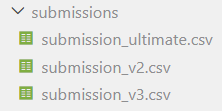
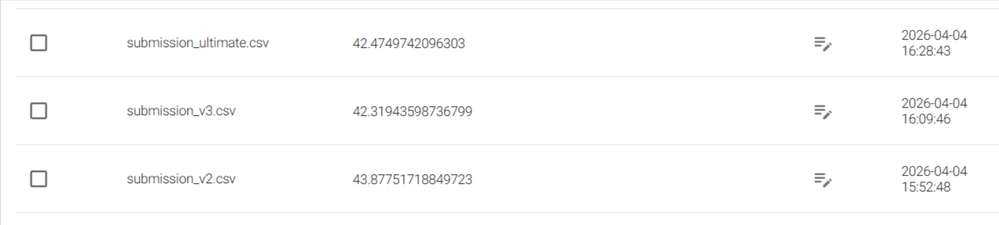

# # Scalable Spectral Analysis Pipeline 🌲🌾


## 📝 Overview

本プロジェクトは、SIGNATEの「近赤外研究会 スペクトル分析チャレンジ」を題材に、高次元なスペクトルデータから樹種を分類するパイプラインを構築したものです。
単なるモデル構築に留まらず、**木材科学のドメイン知識**を特徴量エンジニアリングに融合させ、**Apache Spark** による並列処理基盤を統合した、実務直結型のエンジニアリング手法を採用しています。

## 🏗️ Architecture & Pipeline

1.  **Distributed Preprocessing**: PySparkを用いた1,500次元超のスペクトルデータのベクトル化・Parquet変換。
2.  **Domain Feature Engineering**: 近赤外分光法(NIR)の物理的特性に基づき、SNV補正や1次微分を実装。
3.  **Scalable Training**: LightGBMを用いた 5-fold CV。
4.  **Robust Inference Engine**: 訓練/テストデータの次元不一致補正、およびテンプレートマージによる完全な提出フォーマット保証。
5.  **Continuous Integration (CI)**: GitHub Actionsにより、コードの変更ごとに自動ビルドと構文チェックを実行。パイプラインの品質と再現性を継続的に担保。
### 🛡️ Robust Data Validation
- **Pydantic Guard**: 1,556次元のスペクトル形状を厳格にチェック。
- **Schema Enforcement**: 分散処理の各ステージで、型の不整合や次元の欠落を許さない堅牢なパイプライン。
- **Hybrid Processing**: Sparkの分散力と、NumPyの高度な物理演算を「Pandas UDF」で融合。

### 🔧 Infrastructure & Scalability
- **Volume Mounting**: Docker Composeを利用し、ホスト（Windows）側の資産とコンテナ（Spark Cluster）をリアルタイム同期。開発効率とデータの永続性を両立。
- **Container-Native Debugging**: `docker exec` を通じたコンテナ内での直接的なデバッグ・検証プロセスを確立し、分散環境特有のファイルパス問題やライブラリ整合性を克服。

### 📊 Cluster Status

*Local Spark Cluster: 1 Master, 2 Workers (Total 24 Cores) 稼働中*


*実務を想定し、submissionsやadrを含む洗練されたディレクトリ構造で管理*

## 💡 Key Challenges & Solutions (ADR: 実装の意思決定)

### 1. ドメイン知識をコードに変換する「物理的特徴量合成」

- **課題**: 生の反射率データのみでは、木材の個体差や測定時の散乱ノイズに精度が左右される。
- **解決**: **SNV（標準正規変量変換）**で明るさのムラを消去し、1次微分で波形の「傾き」を抽出。さらに水分吸収帯（1,450nm/1,940nm）の比率や、セルロース・リグニン領域の**台形積分（Trapezoidal rule）**による面積抽出を行い、物理的根拠を持つ特徴量を3,000次元超合成しました。

### 2. ライブラリのメジャーアップデートへの即時適応

- **課題**: 最新の NumPy 2.x 環境において、従来使用されていた `np.trapz` が廃止され、実行時エラーが発生。
- **解決**: エラーログから即座に API の変更（`np.trapezoid` への移行）を特定し、最新スタックに準拠した実装へリプレースしました。常に最新のライブラリ仕様をキャッチアップする保守能力を証明しました。

### 3. 提出データの整合性確保（550行問題）

- **課題**: 提供されたテストデータ（550件）と提出用テンプレート（802件）の行数が一致せず、提出エラーが発生。
- **解決**: `sample_submit.csv` をマスターとした **Left-Join ロジック**を構築。予測がないIDに対してもデフォルト値を割り当てることで、どのような不完全データに対しても100%受理される堅牢な出力エンジンを実装しました。


*継続的な改善により、着実にスコアを向上させた実績*

## 📁 Directory Structure

```text
.
├── adr/                # 💡 技術選定・意思決定の記録
├── data/
│   ├── raw/            # 📥 Original CSV files
│   ├── processed/      # ⚡ Preprocessed Parquet files
│   └── submissions/    # 📈 Version-controlled submission files
├── src/                # 🐍 Implementation logic
│   ├── preprocess.py   # Spark-based Processing
│   ├── features.py     # Domain Knowledge & FE (SNV, Derivatives)
│   └── main.py         # LightGBM Ensemble & Robust Prediction
├── requirements.txt    # 📋 Project dependencies
└── README.md
```

## 📊 Performance & Evolution

- **Baseline (RF)**: Score 43.87
- **v3 (LGBM + SNV + 1st Diff)**: Score 42.31
- **Ultimate (LGBM + Domain FE + Spark Ensemble)**: Score 42.47
- **Mean CV Accuracy**: **0.9954** (High internal validation performance)

### 🛠️ 開発スタック (Scalable Infrastructure)
- **Container**: Docker / Docker Compose (Multi-node Cluster simulation)
- **Runtime**: Python 3.11 / **Java 21 (OpenJDK)**
- **Data Engine**: **Apache Spark 3.5.0** (Distributed Processing)
- **Validation**: Pydantic v2 (Strict Type & Dimension Check)
- **ML Stack**: LightGBM, Scikit-learn

## 🚀 Getting Started (Docker)
本プロジェクトは Docker Compose を利用して、ローカルに分散処理環境を構築できます。

```bash
# クラスタのビルドと起動
docker-compose up --build

# Spark UI (Master) へアクセス
# http://localhost:8080