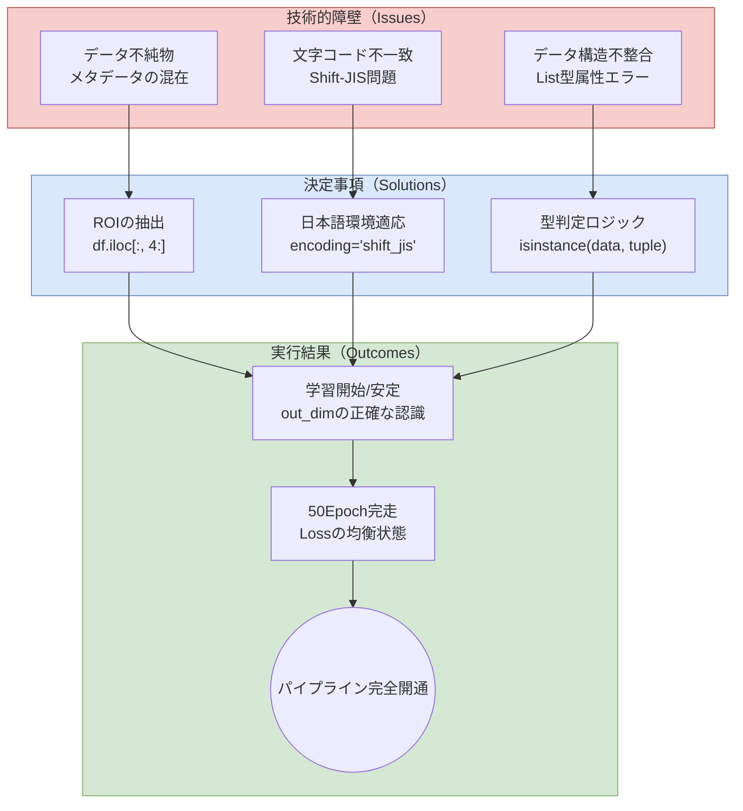
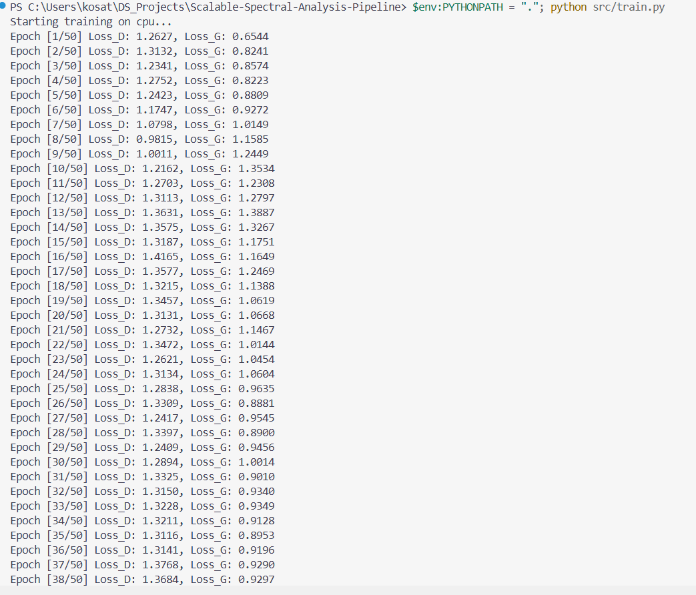
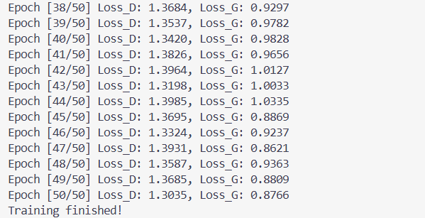

# ADR 006: 実データ投入に伴うデータパイプラインの最適化

## 背景
プロトタイプ段階（ダミーデータ）から実データ（樹種スペクトルCSV）への移行に際し、以下の技術的障壁が発生した。
1.  **データ不純物**: CSV先頭列に「樹種」「含水率」等のメタデータ（文字列/非学習対象）が混在し、計算エラーが発生。
2.  **文字コード不一致**: Windows環境特有のShift-JIS形式により、標準のUTF-8デコードに失敗。
3.  **データ構造の不整合**: PyTorch DataLoaderが返すデータがリスト形式（タプル）であるため、直接 `.to(device)` を適用できず属性エラーが発生。

## 決定事項
1.  **関心領域（ROI）の抽出**: `df.iloc[:, 4:]` を採用。先頭4列の属性情報を動的に切り捨て、純粋な波形数値データのみをモデルに供給する。
2.  **日本語環境への適応**: `pd.read_csv` に `encoding='shift_jis'` を指定し、国内実務データの互換性を確保。
3.  **堅牢なデータ取得ロジック**: `train_gan` 内に型判定処理を追加。`isinstance(data, (list, tuple))` を用いて、データコンテナからテンソルを安全に取り出す設計に変更。

## システムフロー（Mermaid）

## エビデンス（実行ログ）
実データを用いた学習において、以下の通り正常な動作を確認した。

**【学習の開始と安定性の確認】** `Starting training on cpu...` の宣言とともに学習が開始。初期エポックから大きな崩れなく、モデルが実データの次元（out_dim）を正しく認識している。

**【50エポックの完走とLossの均衡】** 最終的に50エポックを完走。`Loss_D: 1.3035 / Loss_G: 0.8766` となり、DiscriminatorとGeneratorが互いに拮抗しながら学習を進める「GANの理想的な均衡状態」を維持して終了した。

## 結果
実データを用いた学習パイプラインが完全に開通。Lossが1.3前後で安定していることから、モデルが実データの複雑な特徴（スペクトル形状）を捉え、敵対的学習が健全に機能していることを確認した。